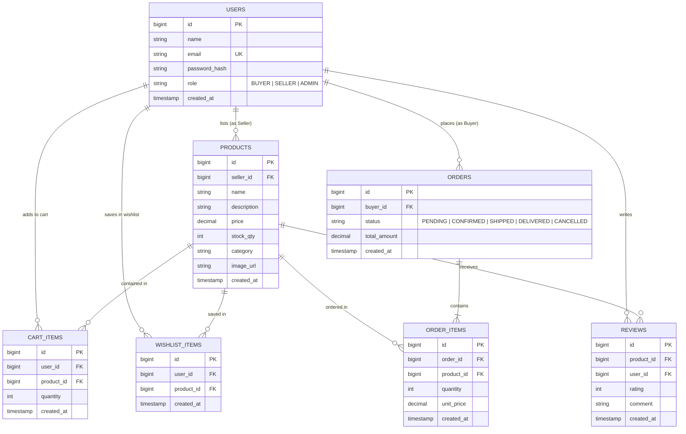

# AmeerRasik Mart - Entity Relationship Diagram

The following Mermaid diagram represents the relational database schema of AmeerRasik Mart:

```mermaid
erDiagram
    USERS ||--o{ PRODUCTS : "lists (as Seller)"
    USERS ||--o{ CART_ITEMS : "adds to cart"
    USERS ||--o{ WISHLIST_ITEMS : "saves in wishlist"
    USERS ||--o{ ORDERS : "places (as Buyer)"
    USERS ||--o{ REVIEWS : "writes"
    
    PRODUCTS ||--o{ CART_ITEMS : "contained in"
    PRODUCTS ||--o{ WISHLIST_ITEMS : "saved in"
    PRODUCTS ||--o{ ORDER_ITEMS : "ordered in"
    PRODUCTS ||--o{ REVIEWS : "receives"
    
    ORDERS ||--|{ ORDER_ITEMS : "contains"

    USERS {
        bigint id PK
        string name
        string email UK
        string password_hash
        string role "BUYER | SELLER | ADMIN"
        timestamp created_at
    }

    PRODUCTS {
        bigint id PK
        bigint seller_id FK
        string name
        string description
        decimal price
        int stock_qty
        string category
        string image_url
        timestamp created_at
    }

    CART_ITEMS {
        bigint id PK
        bigint user_id FK
        bigint product_id FK
        int quantity
        timestamp created_at
    }

    WISHLIST_ITEMS {
        bigint id PK
        bigint user_id FK
        bigint product_id FK
        timestamp created_at
    }

    ORDERS {
        bigint id PK
        bigint buyer_id FK
        string status "PENDING | CONFIRMED | SHIPPED | DELIVERED | CANCELLED"
        decimal total_amount
        timestamp created_at
    }

    ORDER_ITEMS {
        bigint id PK
        bigint order_id FK
        bigint product_id FK
        int quantity
        decimal unit_price
        timestamp created_at
    }

    REVIEWS {
        bigint id PK
        bigint product_id FK
        bigint user_id FK
        int rating
        string comment
        timestamp created_at
    }
```
