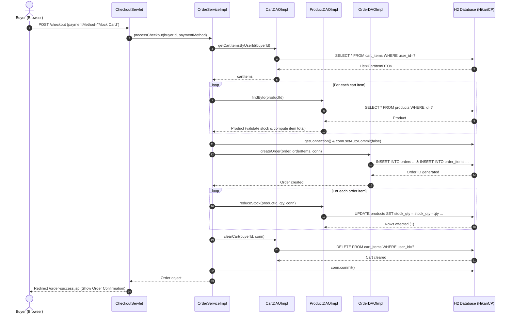

# AmeerRasik Mart - Sequence Diagram (Checkout & Order Placement)

The following sequence diagram details the end-to-end flow from browser checkout down to database transaction and response path:

```mermaid
sequenceDiagram
    autonumber
    actor Buyer as Buyer (Browser)
    participant Servlet as CheckoutServlet
    participant Service as OrderServiceImpl
    participant CartDAO as CartDAOImpl
    participant ProdDAO as ProductDAOImpl
    participant OrdDAO as OrderDAOImpl
    participant DB as H2 Database (HikariCP)

    Buyer->>Servlet: POST /checkout (paymentMethod="Mock Card")
    Servlet->>Service: processCheckout(buyerId, paymentMethod)
    
    Service->>CartDAO: getCartItemsByUserId(buyerId)
    CartDAO->>DB: SELECT * FROM cart_items WHERE user_id=?
    DB-->>CartDAO: List<CartItemDTO>
    CartDAO-->>Service: cartItems
    
    loop For each cart item
        Service->>ProdDAO: findById(productId)
        ProdDAO->>DB: SELECT * FROM products WHERE id=?
        DB-->>ProdDAO: Product
        ProdDAO-->>Service: Product (validate stock & compute item total)
    end
    
    Service->>DB: getConnection() & conn.setAutoCommit(false)
    
    Service->>OrdDAO: createOrder(order, orderItems, conn)
    OrdDAO->>DB: INSERT INTO orders ... & INSERT INTO order_items ...
    DB-->>OrdDAO: Order ID generated
    OrdDAO-->>Service: Order created
    
    loop For each order item
        Service->>ProdDAO: reduceStock(productId, qty, conn)
        ProdDAO->>DB: UPDATE products SET stock_qty = stock_qty - qty ...
        DB-->>ProdDAO: Rows affected (1)
    end
    
    Service->>CartDAO: clearCart(buyerId, conn)
    CartDAO->>DB: DELETE FROM cart_items WHERE user_id=?
    DB-->>CartDAO: Cart cleared
    
    Service->>DB: conn.commit()
    Service-->>Servlet: Order object
    Servlet-->>Buyer: Redirect /order-success.jsp (Show Order Confirmation)
```
