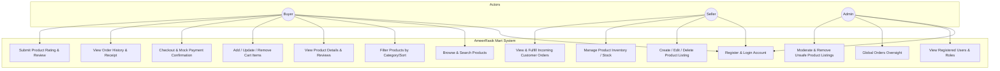

# AmeerRasik Mart - Use Case Diagram

The following diagram details the interactions between system actors (Buyer, Seller, Admin) and key marketplace features:

```mermaid
graph TD
    subgraph Actors
        Buyer((Buyer))
        Seller((Seller))
        Admin((Admin))
    end

    subgraph AmeerRasik Mart System
        UC1[Register & Login Account]
        UC2[Browse & Search Products]
        UC3[Filter Products by Category/Sort]
        UC4[View Product Details & Reviews]
        UC5[Add / Update / Remove Cart Items]
        UC6[Checkout & Mock Payment Confirmation]
        UC7[View Order History & Receipt]
        UC8[Submit Product Rating & Review]
        
        UC9[Create / Edit / Delete Product Listing]
        UC10[Manage Product Inventory / Stock]
        UC11[View & Fulfill Incoming Customer Orders]
        
        UC12[View Registered Users & Roles]
        UC13[Global Orders Oversight]
        UC14[Moderate & Remove Unsafe Product Listings]
    end

    Buyer --> UC1
    Buyer --> UC2
    Buyer --> UC3
    Buyer --> UC4
    Buyer --> UC5
    Buyer --> UC6
    Buyer --> UC7
    Buyer --> UC8

    Seller --> UC1
    Seller --> UC9
    Seller --> UC10
    Seller --> UC11

    Admin --> UC1
    Admin --> UC12
    Admin --> UC13
    Admin --> UC14
```
